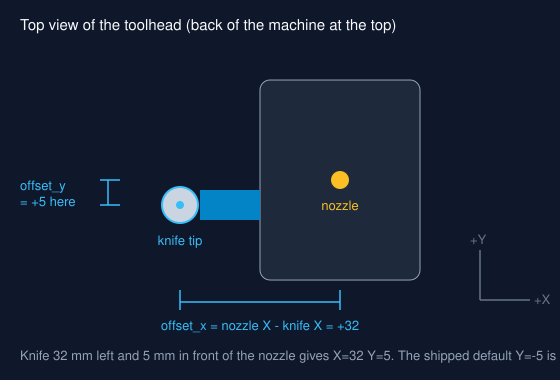

# Mounting the knife

<figure class="device" markdown>

<figcaption>The macros shift every move by (offset_x, offset_y) so job coordinates land on the knife tip.</figcaption>
</figure>

## Holder

1. Print a clamp for the holder body. No mount is published for the Neptune 4
   toolhead at the time of writing; remix a holder clamp from
   [Printables](https://www.printables.com/search/models?q=drag%20knife%20holder)
   to bolt onto the toolhead's side screws. Print in PETG or ABS (PLA creeps
   near the hotend).
2. Mount the holder vertical, with the blade tip 2-4 mm **below** the nozzle
   tip. The nozzle must never reach the mat: while cutting, the knife is the
   lowest point of the toolhead. Measure the drop with calipers and enter it as
   `offset_z` (positive number) so job Z refers to the knife tip.
3. Set blade exposure on the holder: one vinyl plus half the backing thickness,
   usually 0.2-0.3 mm. Check by dragging it over a scrap by hand.

!!! warning
    The hotend must be cold (below 50 C) before mounting or removing the
    holder. `CUTTER_MODE` switches heaters off but does not wait for them to
    cool.

## Measure the offset

Rough value from the mount, then fine-tune in [Calibrating the knife](../setup/calibration.md).

1. Home (`G28`), move the nozzle to the bed centre at Z=5: `G1 X112 Y112 Z5`.
2. Measure from the nozzle centre to the knife centre along X and along Y with
   calipers.
3. Enter them in `_TRIAINA_VARS` as `offset_x = nozzle X - knife X` and
   `offset_y = nozzle Y - knife Y`. Klipper adds the G-code offset to every
   move, so with the knife 32 mm **left** of the nozzle, `offset_x = 32` moves
   the nozzle 32 mm right and puts the knife on the commanded point. Positive X
   is toward the right of the machine; positive Y is toward the back.

## Z height

The Neptune 4 homes Z with its probe at the nozzle. With the mat on the bed:

1. Remove the holder, `G28` (the probe needs a clear nozzle on some revisions),
   refit the holder, then `CUTTER_MODE`.
2. Jog the knife over the mat and lower Z in 0.05 mm steps until the blade
   just touches vinyl.
3. Set `z_cut` to that Z minus 0.1 mm; set `z_travel` to `z_cut + 3`.
