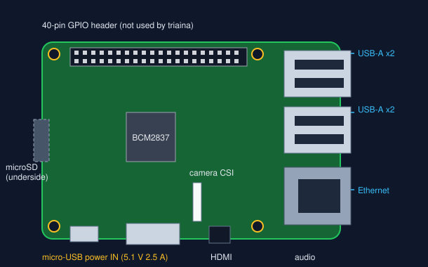
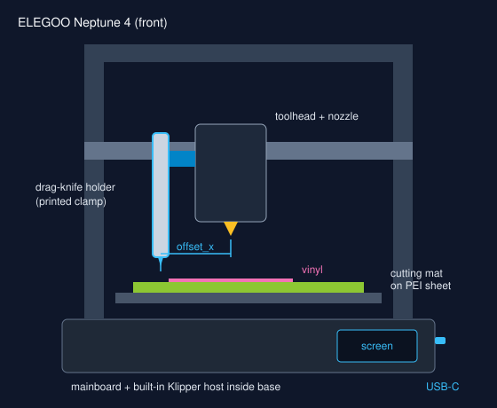
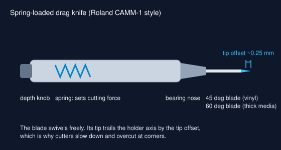

# Parts and where to buy

Prices are approximate (USD, late 2026) and links go to the manufacturer or a
long-standing reseller where one exists. Where only a marketplace search is
listed, any listing matching the spec works; check the dimensions before you
order.

!!! note "Images"
    The drawings on this site are original diagrams made for triaina. For
    product photos, follow the store links.

## Required

| Part | Spec | Why | Where | Approx |
|---|---|---|---|---|
| ELEGOO Neptune 4 | Stock firmware (Klipper) | The machine that moves the knife | [elegoo.com](https://www.elegoo.com/products/elegoo-neptune-4-fdm-3d-printer) | $220 |
| Raspberry Pi 3 Model B | 1 GB, Wi-Fi + Ethernet | Companion host: runs triaina scripts, optional camera; Klipper host in experimental Topology B | [raspberrypi.com](https://www.raspberrypi.com/products/raspberry-pi-3-model-b/), [Adafruit](https://www.adafruit.com/product/3055) | $35 |
| Pi power supply | 5.1 V 2.5 A micro-USB | A phone charger browns out a Pi 3 under load | [Official PSU](https://www.raspberrypi.com/products/micro-usb-power-supply/), [Adafruit alternative](https://www.adafruit.com/product/1995) | $8 |
| microSD card | 16-32 GB, A1, Class 10 | Raspberry Pi OS | [SanDisk Ultra 32 GB](https://www.amazon.com/dp/B073JWXGNT) | $9 |
| Drag-knife holder | Roland CAMM-1 compatible, 10-12 mm body, spring loaded | Holds and swivels the blade | [Amazon search](https://www.amazon.com/s?k=roland+drag+knife+holder) | $10-20 |
| Blades | Roland compatible, 45 deg (vinyl) and 60 deg (thick media) | The cutting edge | [Amazon search](https://www.amazon.com/s?k=roland+compatible+blades+45+60) | $8 per 5 |
| Knife mount | Printed clamp for the holder | Fixes the holder beside the nozzle | Remix a holder mount from [Printables](https://www.printables.com/search/models?q=drag%20knife%20holder) to the Neptune 4 toolhead; see [Mounting the knife](knife-mount.md) | filament |
| Cutting mat | 12 x 12 in, medium tack (Cricut StandardGrip or similar) | Holds vinyl flat; protects the PEI sheet | [Cricut](https://www.cricut.com/en-us/search?q=standardgrip) | $15 for 3 |
| Adhesive vinyl | Oracal 651 or equivalent | The material | [ORAFOL product page](https://www.orafol.com/en/americas/products/oracal-651-intermediate-cal); buy from a sign-supply shop | $10-20 per roll |

## Network

| Part | Spec | Why | Where | Approx |
|---|---|---|---|---|
| Network switch (recommended) | 5-port unmanaged, 10/100 is enough: TP-Link TL-SF1005D | One cable back to the router for both the printer (wired-only) and the Pi | [TP-Link TL-SF1005D listings](https://www.pricerunner.com/pl/167-972784/Switches/TP-Link-TL-SF1005D-Compare-Prices), [PB Tech](https://www.pbtech.com/product/SWHTPL1005/product/SWHTPL1005/TP-Link-TL-SF1005D-5-Port-10100M-Unmanaged-Switch) | $7-15 |
| Patch cables | Cat5e or Cat6, 3 x 1-2 m | Router to switch, switch to Pi, switch to printer | any | $5 |

Gigabit (TP-Link TL-SG105, about twice the price) buys nothing here: the Pi 3's
Ethernet is 100 Mbit and the traffic is tiny. Choose it only if other devices
will share the switch. Skip the switch entirely if the router has two free
ports within cable reach of the printer.

## Optional: console cable

| Part | Spec | Why | Where | Approx |
|---|---|---|---|---|
| USB cable | USB-A to USB-C | Recovery console to the printer's Linux host | any | $5 |
| Kapton tape | Polyimide, 5-10 mm wide | Covers the 5 V pin so the two supplies do not back-feed | [Amazon search](https://www.amazon.com/s?k=kapton+tape) | $7 |
| USB 5 V blocker (alternative to tape) | USB-A inline, data + GND pass-through | Same job as the tape, reusable | [PortaPow-style blocker](https://portablenetworks.com/products/pwr-blocker), [Amazon search](https://www.amazon.com/s?k=usb+5v+blocker) | $10 |

## Optional

| Part | Why | Where | Approx |
|---|---|---|---|
| Raspberry Pi Camera Module v2 | Watch the cut remotely | [Adafruit](https://www.adafruit.com/product/3099) | $25 |
| Pi 3 case with fan | Keeps the Pi under throttling temperature next to the printer | any | $10 |
| Weeding hook and transfer tape | Finishing the sticker | any craft store | $10 |

## The devices

<figure class="device" markdown>

<figcaption>Raspberry Pi 3 Model B. Power goes in the micro-USB on the bottom edge; network on the Ethernet jack or Wi-Fi.</figcaption>
</figure>

<figure class="device" markdown>

<figcaption>ELEGOO Neptune 4 with the knife holder clamped beside the nozzle and a cutting mat on the bed.</figcaption>
</figure>

<figure class="device" markdown>

<figcaption>Spring-loaded Roland-style drag knife. The blade swivels; its tip trails the holder axis by about 0.25 mm.</figcaption>
</figure>

## Reference documents

| Document | Link |
|---|---|
| Raspberry Pi 3 B mechanical drawing (PDF) | [datasheets.raspberrypi.com](https://datasheets.raspberrypi.com/rpi3/raspberry-pi-3-b-mechanical-drawing.pdf) |
| Raspberry Pi hardware documentation | [raspberrypi.com/documentation](https://www.raspberrypi.com/documentation/computers/raspberry-pi.html) |
| Klipper G-code reference | [klipper3d.org/G-Codes.html](https://www.klipper3d.org/G-Codes.html) |
| Moonraker API | [moonraker.readthedocs.io](https://moonraker.readthedocs.io/en/latest/external_api/introduction/) |
| OctoPrint REST API | [docs.octoprint.org](https://docs.octoprint.org/en/master/api/index.html) |
| Inkcut | [github.com/inkcut/inkcut](https://github.com/inkcut/inkcut) |
| OpenNept4une (community image for the built-in host) | [github.com/OpenNeptune3D/OpenNept4une](https://github.com/OpenNeptune3D/OpenNept4une) |
