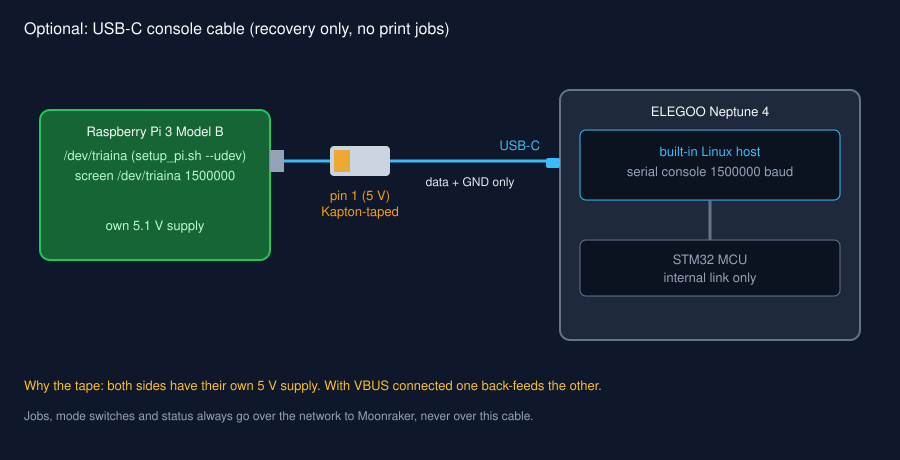

# Wiring the Raspberry Pi

Read [System overview](overview.md) first. The Pi and the printer talk over the
network; the USB cable described at the end is optional.

!!! danger "Mains"
    The printer PSU is mains powered. Never open the printer base with the
    power cord connected. Nothing in triaina requires touching mains wiring.

## Network connection

<figure class="diagram" markdown>

<figcaption>Pi and printer each have their own supply and join the same network. No cable between them.</figcaption>
</figure>

### Connections

| # | From | To | Cable | Notes |
|---|---|---|---|---|
| 1 | Wall outlet | Pi PSU | Mains plug | Official 5.1 V 2.5 A unit |
| 2 | Pi PSU | Pi micro-USB power port (bottom edge, next to HDMI) | Captive micro-USB | Do not power the Pi from the printer's USB |
| 3 | Router LAN port | Switch | Cat5e or better | Skip the switch if the router has two free ports next to the printer |
| 4 | Pi Ethernet jack | Switch | Cat5e or better | Or the Pi's Wi-Fi (configured in Raspberry Pi Imager) |
| 5 | Printer RJ45 port | Switch | Cat5e or better | The printer has no built-in Wi-Fi; see below. Note its address or `.local` name |
| 6 | Pi CSI connector | Camera Module | 15-pin ribbon, contacts toward the HDMI port | Optional |
| 7 | Wall outlet | Printer PSU | Printer's mains cord | Check the 115/230 V switch if your unit has one |
| 8 | Wall outlet | Switch power adapter | Supplied 5 V or 9 V adapter | |

**Why a switch.** The printer is wired-only (an RJ45 port, no built-in Wi-Fi,
per [Obico's Neptune 4 Pro guide](https://www.obico.io/blog/how-to-connect-your-elegoo-neptune-4-pro-to-wifi/);
the Neptune 4 uses the same board), and the Pi is most reliable wired too. A
small unmanaged switch next to the printer needs one cable back to the router
instead of two. 10/100 is plenty: the Pi 3's Ethernet is 100 Mbit and the
traffic is G-code uploads and a status poll once a second. See
[Parts](parts.md#network).

**Printer on Wi-Fi instead.** Possible with a USB Wi-Fi dongle whose driver the
printer's Linux image includes (Obico reports the TP-Link TL-WN725N working),
set up over a wired connection first. Wired is simpler and does not drop.

### Bring-up order

1. Flash Raspberry Pi OS Lite (64-bit) with Raspberry Pi Imager; set host
   name `triaina`, user, Wi-Fi and SSH in the Imager settings.
2. Connect the switch (3, 8), then the Pi (4) and the printer (5).
3. Power the Pi (1-2). It appears as `triaina.local` after about a minute.
4. Power the printer (7). Read its IP address on its screen or in your
   router's client list.
5. From the Pi, check you can reach Moonraker:

    ```bash
    curl -s http://neptune4.local:7125/server/info | head -c 300
    ```

    Replace `neptune4.local` with your printer's name or address.
6. Continue with [Raspberry Pi setup](../setup/pi.md).

## Optional: USB-C console cable

The printer's USB-C port is the built-in host's serial console. It is useful
when the printer drops off the network: from the Pi you can log in, check
`ip addr` and restart services. It carries no print jobs.

<figure class="diagram" markdown>

<figcaption>Optional recovery link. 5 V is blocked so the two supplies cannot back-feed.</figcaption>
</figure>

| # | From | To | Cable | Notes |
|---|---|---|---|---|
| 1 | Pi USB-A (any) | Printer USB-C | USB-A to USB-C, **pin 1 taped** | Data and GND only |

Then on the Pi:

```bash
scripts/setup_pi.sh --udev          # binds the console bridge to /dev/triaina
screen /dev/triaina 1500000         # log in; Ctrl-A K to quit
```

Default login on OpenNept4une images is `mks` / `makerbase`; stock ELEGOO
images differ by firmware version.

### Blocking 5 V on the console cable

Both boards have their own 5 V supply. With VBUS connected, whichever supply is
higher pushes current into the other board. Symptoms range from the printer's
board staying half-powered with the printer off, to Pi undervoltage warnings,
to a damaged regulator.

<figure class="device" markdown>

<figcaption>Cover pin 1 (VBUS) on the Pi end of the cable with Kapton tape. Confirm which outer contact is VBUS with a multimeter.</figcaption>
</figure>

1. Unplug the cable from both ends.
2. Find pin 1. Pins 1 (VBUS) and 4 (GND) are the two longer outer contacts;
   which side is which depends on how you hold the plug, so measure: plug the
   cable's **printer** end into the powered-on printer, leave the Pi end free,
   and put a multimeter (DC volts) between an outer contact and the metal
   shell. The contact that reads about 5 V is pin 1. If the port reads 0 V on
   both, the printer does not supply 5 V on that port and the tape is still
   cheap insurance against the Pi feeding it.
3. Cut a strip of Kapton tape about 2 mm wide and 10 mm long. Lay it over pin 1
   only, fold the end over the tip of the tongue so it cannot peel back on
   insertion.
4. Plug the taped end into the Pi.
5. Check: with the printer off and the Pi on, the printer's screen and board
   LEDs stay dark. If they light up, the tape slipped.

A USB 5 V blocker adapter does the same job without tape. Put it on the Pi end.

## Topology B: Pi as Klipper host (experimental)

!!! danger "Unverified, opens the printer"
    Nobody has confirmed the MCU UART pins on the Neptune 4 ZNP-K1 board for
    this. Wrong pins or 5 V on a 3.3 V line can destroy the MCU or the Pi.
    Unplug mains before opening the base. Use Topology A unless you accept that.

The USB-C port cannot be used: it is the built-in host's console. The Pi has to
reach the STM32 MCU over a UART instead.

| # | Pi pin | Signal | To |
|---|---|---|---|
| 1 | 8 (GPIO14) | TXD, 3.3 V | MCU UART RX pin (to be identified on your board) |
| 2 | 10 (GPIO15) | RXD, 3.3 V | MCU UART TX pin |
| 3 | 6 | GND | MCU board GND |

Never connect the Pi's 5 V pins (2, 4) to the printer. Each side keeps its own
supply.

Steps, in outline:

1. Identify a free USART on the STM32 and its pins on the board (schematic,
   OpenNept4une community, continuity tester). Record board revision and pins.
2. Build Klipper MCU firmware for the board's STM32 with that USART as the
   communication interface; flash it with the microSD method documented by
   [OpenNept4une](https://github.com/OpenNeptune3D/OpenNept4une/wiki).
3. On the Pi: `dtoverlay=disable-bt` in `/boot/firmware/config.txt` (gives the
   full PL011 UART on `/dev/ttyAMA0`), disable the serial login console, install
   Klipper, Moonraker and Fluidd with [KIAUH](https://github.com/dw-0/kiauh).
4. Stop the built-in host's Klipper service so it does not fight for the MCU.
5. In the Pi's `printer.cfg`:

    ```ini
    [mcu]
    serial: /dev/ttyAMA0
    baud: 250000
    restart_method: command
    ```

    Copy steppers, probe and bed-mesh sections from the stock `printer.cfg`.
6. Add `[include klipper_cutter_macros.cfg]` as in [Klipper macros](../setup/klipper.md),
   and set `TRIAINA_HOST=localhost`.

If you get this working, open an issue with the board revision and pins so it
can move out of experimental.

## Checklist

- [ ] Pi on its own 5.1 V supply
- [ ] Pi and printer on the same network, Moonraker reachable from the Pi
- [ ] (console cable only) 5 V pin blocked, verified with the printer off
- [ ] (Topology B only) UART at 3.3 V, GND shared, no 5 V between boards
- [ ] Knife holder mounted, see [Mounting the knife](knife-mount.md)
