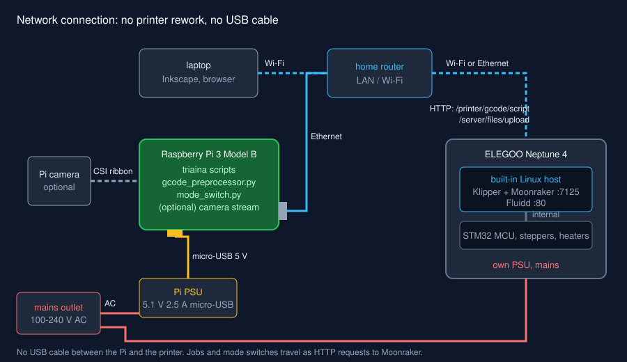
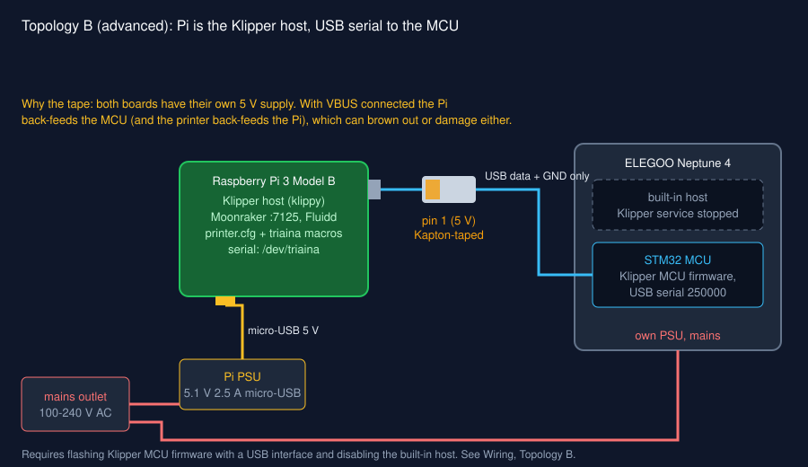
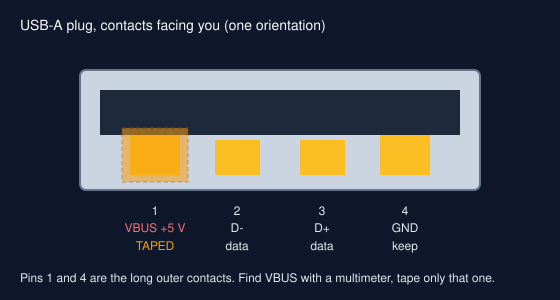

# Wiring the Raspberry Pi

Read [System overview](overview.md) first to choose a topology.

!!! danger "Mains"
    The printer PSU is mains powered. Never open the printer base with the
    power cord connected. Nothing in triaina requires touching mains wiring.

## Topology A: network only (recommended)

<figure class="diagram" markdown>

<figcaption>Pi and printer each have their own supply and join the same network. No cable between them.</figcaption>
</figure>

### Connections

| # | From | To | Cable | Notes |
|---|---|---|---|---|
| 1 | Wall outlet | Pi PSU | Mains plug | Official 5.1 V 2.5 A unit |
| 2 | Pi PSU | Pi micro-USB power port (bottom edge, next to HDMI) | Captive micro-USB | Do not power the Pi from the printer's USB |
| 3 | Pi Ethernet jack | Router | Cat5e or better | Or use the Pi's Wi-Fi (configured in Raspberry Pi Imager) |
| 4 | Printer | Router | Wi-Fi (printer screen: Settings > Network) or Ethernet | Note the printer's address or `.local` name |
| 5 | Pi CSI connector | Camera Module | 15-pin ribbon, contacts toward the HDMI port | Optional |
| 6 | Wall outlet | Printer PSU | Printer's mains cord | Check the 115/230 V switch if your unit has one |

### Bring-up order

1. Flash Raspberry Pi OS Lite (64-bit) with Raspberry Pi Imager; set host
   name `triaina`, user, Wi-Fi and SSH in the Imager settings.
2. Power the Pi (connections 1-2). It appears as `triaina.local` after about a
   minute.
3. Power the printer and join it to the same network.
4. From the Pi, check you can reach Moonraker:

    ```bash
    curl -s http://neptune4.local:7125/server/info | head -c 300
    ```

    Replace `neptune4.local` with your printer's name or address.
5. Continue with [Raspberry Pi setup](../setup/pi.md) using `--skip-udev`.

## Topology B: Pi as the Klipper host (advanced)

<figure class="diagram" markdown>

<figcaption>Pi runs Klipper and talks to the printer's MCU over USB. The 5 V line in the cable is blocked.</figcaption>
</figure>

!!! warning "Unverified on every board revision"
    ELEGOO has shipped more than one board revision. Before buying anything,
    confirm on your unit that the external USB port reaches the STM32 MCU
    (`lsusb` on the Pi shows a new device when you plug it in). If it only
    reaches the built-in host, Topology B needs internal rewiring and is out of
    scope for this guide.

### Connections

| # | From | To | Cable | Notes |
|---|---|---|---|---|
| 1 | Wall outlet | Pi PSU | Mains plug | |
| 2 | Pi PSU | Pi micro-USB power | Captive micro-USB | The Pi must have its own supply |
| 3 | Pi USB-A (any of the four) | Printer USB port | USB-A to printer connector, **pin 1 taped** | Data (D+, D-) and GND only |
| 4 | Pi Ethernet / Wi-Fi | Router | | So you can reach Fluidd on the Pi |
| 5 | Wall outlet | Printer PSU | Mains cord | |

### Blocking 5 V on the USB cable

Both boards have their own 5 V supply. With VBUS connected, whichever supply is
higher pushes current into the other board. Symptoms range from the MCU staying
half-powered with the printer off, to Pi undervoltage warnings, to a damaged
regulator.

<figure class="device" markdown>

<figcaption>Cover pin 1 (VBUS) on the Pi end of the cable with Kapton tape. Confirm which outer contact is VBUS with a multimeter.</figcaption>
</figure>

1. Unplug the cable from both ends.
2. Find pin 1. Pins 1 (VBUS) and 4 (GND) are the two longer outer contacts;
   which side is which depends on how you hold the plug, so measure: plug the
   cable's **printer** end into the powered-on printer, leave the Pi end free,
   and put a multimeter (DC volts) between an outer contact and the metal
   shell. The contact that reads about 5 V is pin 1. If the port reads 0 V on
   both, the printer does not supply 5 V on that port and the tape is still
   cheap insurance against the Pi feeding it.
3. Cut a strip of Kapton tape about 2 mm wide and 10 mm long. Lay it over pin 1
   only, fold the end over the tip of the tongue so it cannot peel back on
   insertion.
4. Plug the taped end into the Pi.
5. Check: with the printer off and the Pi on, the printer's screen and board
   LEDs stay dark. If they light up, the tape slipped.

A USB 5 V blocker adapter does the same job without tape. Put it on the Pi end.

### Software for Topology B

1. Install Klipper, Moonraker and Fluidd on the Pi (KIAUH is the usual
   installer).
2. Build Klipper MCU firmware for the Neptune 4's STM32 with USB as the
   communication interface, and flash it following ELEGOO's or the
   OpenNept4une project's instructions for your board revision.
3. Stop the built-in host's Klipper service so two hosts do not fight over the
   MCU.
4. Run [setup_pi.sh](../setup/pi.md) without `--skip-udev`; the MCU is then
   `/dev/triaina`.
5. In the Pi's `printer.cfg`:

    ```ini
    [mcu]
    serial: /dev/triaina
    baud: 250000
    restart_method: command
    ```

    `baud` only matters for a USB-serial bridge (CH340); native USB ignores it.
6. Copy the built-in host's `printer.cfg` sections (steppers, bed mesh, probe)
   to the Pi. Do not invent these values: the stock file is the source of truth
   for pins and rotation distances.

## Checklist

- [ ] Pi on its own 5.1 V supply
- [ ] Pi and printer on the same network, Moonraker reachable from the Pi
- [ ] (B only) 5 V pin blocked, verified with the printer off
- [ ] (B only) `/dev/triaina` exists after replug
- [ ] Knife holder mounted, see [Mounting the knife](knife-mount.md)
