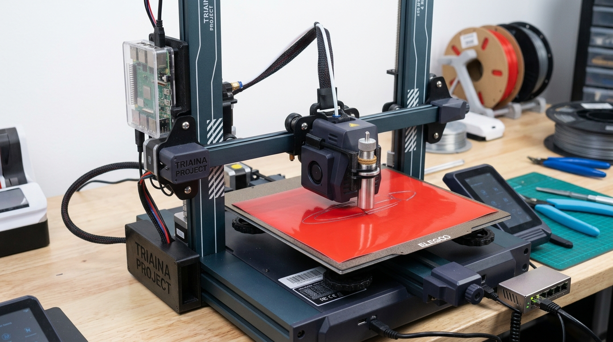

# triaina

Giving your Neptune 4 its proper Greek trident so it can slice vinyl stickers at
1000 mm/s^2.

triaina turns an ELEGOO Neptune 4 into a two-in-one machine: a normal FDM
printer and a drag-knife vinyl cutter. A Raspberry Pi 3 Model B prepares cut
files and switches modes.

<figure class="diagram" markdown>

<figcaption>The Neptune 4 prints and cuts. The Raspberry Pi 3 prepares jobs and controls the workflow.</figcaption>
</figure>

!!! info "Why 'triaina'?"
    *Triaina* is Greek for **trident**, Poseidon's three-pronged spear. The printer
    is a **Neptune** 4, and Neptune is simply Poseidon under the name the Romans
    gave him when they adopted him. This project gives the Neptune its original
    Greek trident back, with three prongs: print, cut, and the Pi that picks
    which. [The whole story](name.md).

!!! tip "Sibling project: kinect-forge"
    triaina makes the object. [kinect-forge](https://nikolareljin.github.io/kinect-forge/)
    makes the model: it turns a Kinect v1 into a 3D scanner that exports meshes.
    Scan a broken part there, print it here.

| Part | What it does |
|---|---|
| [Klipper macros](reference/klipper-macros.md) | `CUTTER_MODE`, `PRINTER_MODE`, `CUT_PLUNGE`, `CUT_RETRACT` |
| [gcode_preprocessor.py](reference/gcode-preprocessor.md) | Turns Inkscape / Inkcut / LightBurn G-code into safe cutter G-code |
| [mode_switch.py](reference/mode-switch.md) | Switches modes over Moonraker or OctoPrint |
| [setup_pi.sh](reference/setup-pi.md) | Provisions the Pi: packages, venv, and the service |
| [Dashboard](use/dashboard.md) | Service on the Pi: live status, mode switch, cut and print jobs; [cuts SVG, DXF, PDF, AI, EPS, PNG, JPG](use/designs.md) directly |

## Start here

1. [Parts and where to buy](hardware/parts.md)
2. [System overview](hardware/overview.md) and [Existing tools](hardware/prior-art.md)
3. [Wiring the Raspberry Pi](hardware/wiring.md)
4. [Mounting the knife](hardware/knife-mount.md)
5. [Raspberry Pi setup](setup/pi.md), [Klipper macros](setup/klipper.md),
   [Calibrating the knife](setup/calibration.md)
6. [Dashboard service](setup/service.md), then [Cutting a sticker](use/workflow.md)
7. Once, with the hardware: [Commissioning checklist](use/commissioning.md)

<figure class="diagram" markdown>

<figcaption>Pi and printer on the same network; jobs go through Moonraker.</figcaption>
</figure>
